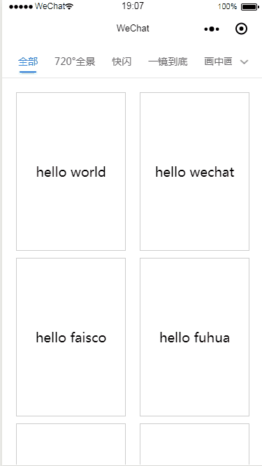

# scroll-tab-view

小程序水平切换多个页面组件

## 效果


## 如何使用
### 两种方法
- 用微信开发者工具打开/tools/demo/，然后直接在项目引入代码
- 使用npm。npm包为`scroll-tab-view`

## 组件文档
### 描述
水平滑动切换页面组件【加强版】。
- 顶部tab可以滚动，而且还有二级tab，支持滚动加载。
- 每个切换的页面都记录了当前页面的一级分类tab的index、二级分类的tab的index、当前页面数据的页数scrollPage。
- 可以判断是否需要重新加载数据。当一级分类tab的index、二级分类的tab的index与之前的旧数据不同时，isReload会变为true，通过触发switchEvent传播到父组件，从而使父组件重新发请求去获取数据。

### 定义字段
| 字段 | 类型 | 是否必填 | 默认值 | 描述 |
| :------: | :------: | :------: | :-----:| :------: |
| firstTab | Array | 是 | 无 | 一级分类。item.name为tab的名字 |
| secondTab | Array | 否 | 无 | 二级分类。item.name为tab的名字 |
| firstTabTitle | String | 否 | 无 | 一级分类的标题描述 |
| secondTabTitle | String | 否 | 无 | 二级分类的标题描述 |

### slot插槽
| slot | 描述 |
| :---: | :---: |
| tab-content-0 | 第一个页面 |
| tab-content-1 | 第二个页面 |
| ... | ... |
| tab-content-{index} | 第n个页面 |


### 绑定的事件
| 键值 | 触发时机 | 携带对象 |
| :---: | :---: | :----: |
| bindswitchEvent| 切换页面的时候触发 | e.detail |

### e.detail对象
| 字段 | 描述 |
|:--: | :--:|
| firstTabIndex | 一级分类tab的index |
| secondTabIndex | 二级分类tab的index |
| firstTabObj | 一级分类数组的当前元素 |
| secondTabObj | 二级分类的数组元素 |
| scrollPage | 当前页面滚动加载的页数 |
| isReLoad | 是否需要重新获取当前页面的数据。当secondTabIndex与旧数据不同时，为true|

## 开发

1. 安装依赖：

```
npm install
```

2. 执行命令：

```
npm run dev
```

默认会在包根目录下生成 miniprogram\_dev 目录，src 中的源代码会被构建并生成到 miniprogram\_dev/components 目录下。如果需要监听文件变化动态构建，则可以执行命令：

```
npm run watch
```

> ps: 如果 minirpogram\_dev 目录下已存在小程序 demo，执行`npm run dev`则不会再将 tools 下的 demo 拷贝到此目录下。而执行`npm run watch`则会监听 tools 目录下的 demo 变动并进行拷贝。

3. 生成的 miniprogram\_dev 目录是一个小程序项目目录，以此目录作为小程序项目目录在开发者工具中打开即可查看自定义组件被使用的效果。

## 目录结构

以下为推荐使用的目录结构，如果有必要开发者也可以自行做一些调整:

```
|--miniprogram_dev // 开发环境构建目录
|--miniprogram_dist // 生产环境构建目录
|--src // 源码
|   |--common // 通用 js 模块
|   |--components // 通用自定义组件
|   |--images // 图片资源
|   |--wxml // 通用 wxml 模版资源
|   |--wxs // 通用 wxs 资源
|   |--wxss // 通用 wxss 资源
|   |
|   |--xxx.js/xxx.wxml/xxx.json/xxx.wxss // 暴露的 js 模块/自定义组件入口文件
|
|--test // 测试用例
|--tools // 构建相关代码
|   |--demo // demo 小程序目录，开发环境下会被拷贝生成到 miniprogram_dev 目录中
|   |--test // 测试工具相关目录
|   |--config.js // 构建相关配置文件
|
|--gulpfile.js
```

> PS：对外暴露的 js 模块/自定义组件请放在 src 目录下，不宜放置在过深的目录。另外新增的暴露模块需要在 tools/config.js 的 entry 字段中补充，不然不会进行构建。


## 测试

* 执行测试用例：

```
npm run test
```

* 检测覆盖率：

```
npm run coverage
```

测试用例放在 test 目录下，其中 test/utils 是已封装好可在测试用例中使用的工具包，具体使用文档请[点击此处查看](./docs/test.md)。在测试中可能需要用到官方提供的一些接口（如`wx.getSystemInfo`），可在 test/utils 下自行模拟实现（里面已内置部分模拟接口）。

> 目前测试框架仍有部分自定义组件的功能不支持（可参考测试工具包使用文档中的 TODO 列表），后续会逐步进行支持。

## 其他命令

* 清空 miniprogram_dist 目录：

```
npm run clean
```

* 清空 miniprogam_dev 目录：

```
npm run clean-dev
```
